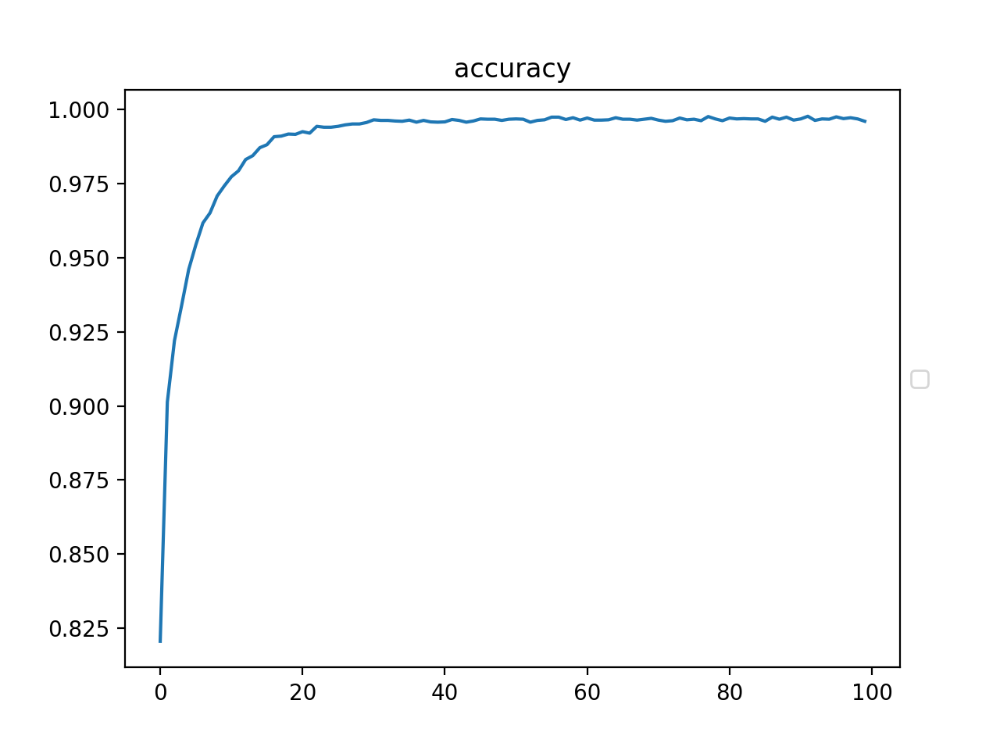
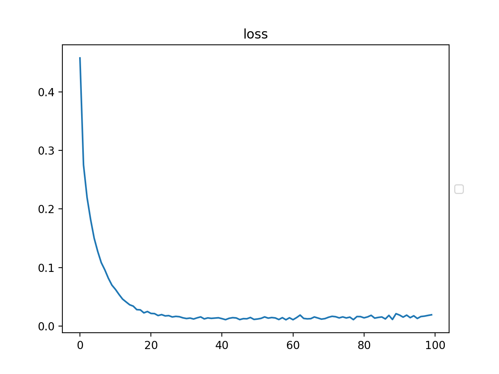

# FruitsClassification
りんご、さくらんぼ、ぶどうの画像をCNNで分類するサンプルです。 

## 概要
このサンプルでは下記のことを行なっています。  
- Flickrからフルーツの画像を取得する
- Flickrから取得した画像を回転させて学習データを増量する
- 画像をCNNで学習させてモデルを出力する
- モデルを使い、りんご、さくらんぼ、ぶどうの画像を分類する

## 環境構築
1. Python3.xをインストールし、次のコマンドを実行してください。
```bash
pip install -r requirements.txt
```

1. Flickrのアカウントを作成し、画像をダウンロードするためのAPIキーを取得してください。  
https://www.flickr.com/

## Flickrからフルーツの画像を取得する
次のコマンドを実行し、分類に使うフルーツの画像をダウンロードしてください。  
key/secret_keyはFlickrのサイトから取得します。  
それぞれのカテゴリで600枚ずつダウンロードします。  
```bash
python download.py key secret_key
```

## Flickrから取得した画像を回転させて学習データを増量する
Flickrから取得した画像を、左右20度に5度ずつ回転し、さらにそれらを反転させて学習のためのデータを増量します。  
これらの画像はnumpyのバイナリとして保存してから学習に使うため、バイナリ名を指定して次のように実行してください。  
ダウンロードした画像のうち100枚はテストデータとして使用しています。  
```bash
python gen_data.py fruits.npy
```

## 画像をCNNで学習させてモデルを出力する
numpyのバイナリから画像を取り出し、CNNのモデルを使って学習していきます。  
学習するパラメータは.h5のファイルに保存されます。  
```bash
python training.py fruis.npy
```

## モデルを使い、りんご、さくらんぼ、ぶどうの画像を分類する
りんご、さくらんぼ、ぶどうの画像を用意して次のように実行してください。  
用意した画像がどのフルーツなのかを判定し、結果を出力します。  
```bash
python predict.py ./apple.png
```

## Accuracy
このモデルのAccuracyはEpoch数100で0.9960です。


## Loss
このモデルのLoss関数はEpoch数100回で0.0195です。

